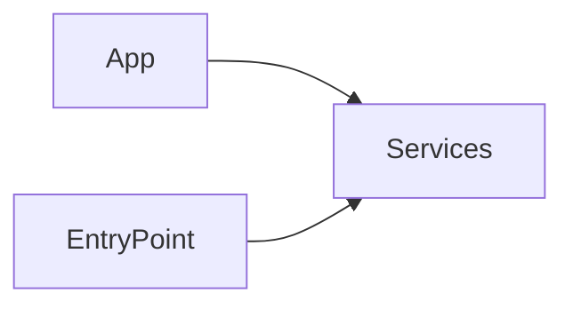

# GAS with Bun

## Architecture

- Microservice
- Serverless
- Domain Driven Design

```mermaid
graph LR
  App --> Services
  EntryPoint --> Services
```

## App

- ビジネスドメイン
- ビジネスロジック

## Services

- 外部リソース
- DB
- リポジトリパターン

## EntryPoint

- 実行されるスクリプト
