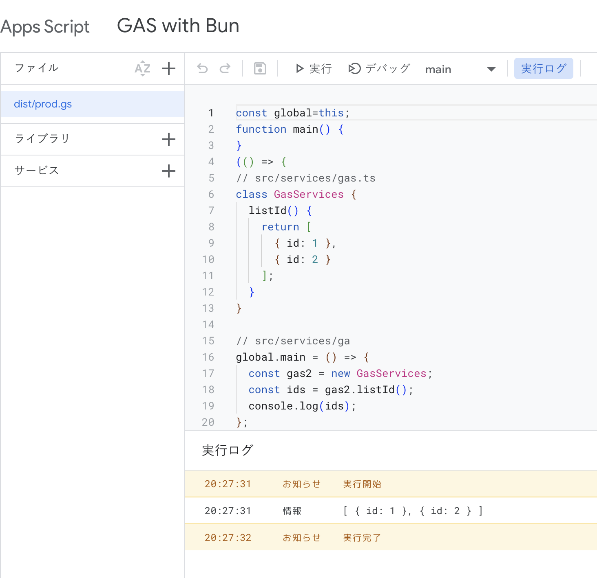

# GAS with Bun



## Using this project as a template

```sh
# first time
bun x @google/clasp login

# recreate your project
rm .clasp.json
bun x @google/clasp create --type standalone --title "GAS with Bun"

# test
bun test

# deploy
bun push
```

## License

Copyright (c) HikaruEgashira. All rights reserved.
